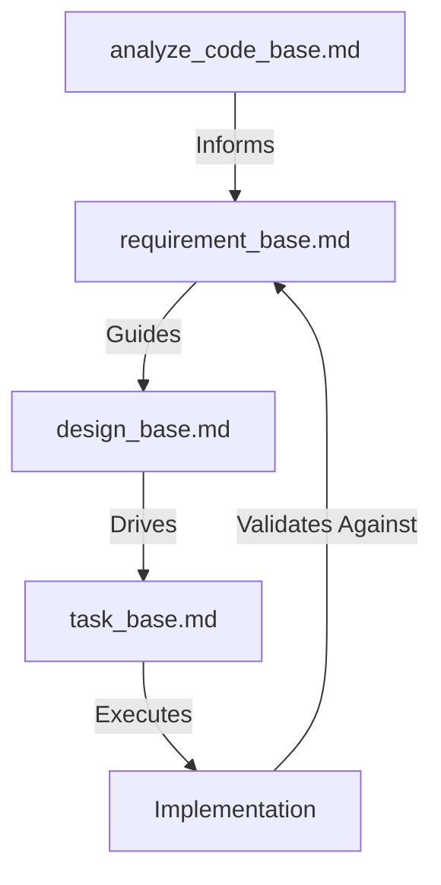

# Framework Methodology: Discover → Plan → Execute

## Overview

The Framework is built on the proven **Discover → Plan → Execute** methodology designed to achieve "right at first" implementation success. This three-phase approach ensures comprehensive context gathering, structured planning, and precise execution while minimizing iterations and rework.

## Core Methodology

### 1. DISCOVER Phase: Comprehensive Context Gathering

**Objective**: Gather all necessary information and context before making any decisions or starting implementation.

#### Key Activities

- **Requirements Analysis**: Complete understanding of what needs to be built/fixed
- **Context Research**: Comprehensive analysis of existing systems, patterns, and constraints
- **Stakeholder Input**: Gather all relevant perspectives and requirements
- **Risk Identification**: Early identification of potential challenges and blockers
- **Success Criteria Definition**: Clear, measurable outcomes and validation methods

#### Validation Checkpoints

Before proceeding to Plan phase:

- [ ] Complete requirements understood and documented
- [ ] All relevant context and constraints identified
- [ ] Potential risks and challenges documented
- [ ] Success criteria clearly defined
- [ ] Stakeholder alignment confirmed

### 2. PLAN Phase: Structured Design & Strategy

**Objective**: Create detailed, validated implementation strategy with built-in quality gates and risk mitigation.

#### Key Activities

- **Architecture Design**: Detailed technical design following established patterns
- **Implementation Roadmap**: Phased approach with validation checkpoints
- **Risk Mitigation**: Specific strategies for identified risks
- **Quality Gates**: Built-in validation and testing strategies
- **Rollback Plans**: Recovery strategies for high-risk changes

#### Validation Checkpoints

Before proceeding to Execute phase:

- [ ] Detailed implementation plan with clear steps
- [ ] Risk mitigation strategies defined
- [ ] Quality gates and validation methods specified
- [ ] Rollback plans for high-risk changes
- [ ] Plan reviewed and approved by stakeholders

### 3. EXECUTE Phase: Precise Implementation

**Objective**: Implement the planned solution with continuous validation and quality assurance.

#### Key Activities

- **Progressive Implementation**: Phased execution following the roadmap
- **Continuous Validation**: Quality gates executed at each checkpoint
- **Real-time Monitoring**: Performance and quality monitoring during implementation
- **Issue Resolution**: Immediate resolution of any issues that arise
- **Documentation**: Complete documentation of implementation and lessons learned

#### Validation Checkpoints

Throughout execution:

- [ ] Each phase validation checkpoints passed
- [ ] Quality gates successfully executed
- [ ] Performance and security validation completed
- [ ] Integration testing passed
- [ ] Documentation and knowledge transfer completed

## Right at First Principles

### 1. Comprehensive Context Before Action

**Principle**: Never start implementation without complete understanding of the context, requirements, and constraints.

**Application**:

- All templates start with comprehensive discovery phases
- Context gathering includes technical, business, and user perspectives
- Existing patterns and gotchas are documented before starting
- Dependencies and integration points are mapped upfront

### 2. Validation-First Approach

**Principle**: Build validation and quality gates into every phase, not as an afterthought.

**Application**:

- Each phase has specific validation checkpoints
- Quality criteria are defined before implementation starts
- Testing strategies are planned during the design phase
- Continuous monitoring and validation throughout execution

### 3. Risk-Aware Planning

**Principle**: Identify and mitigate risks early in the process, not when problems occur.

**Application**:

- Risk assessment is part of the discovery phase
- Mitigation strategies are planned before implementation
- Rollback plans are prepared for high-risk changes
- Progressive implementation reduces risk exposure

### 4. AI-Optimized Structure

**Principle**: Structure information and context in ways that enable AI assistants to be most effective.

**Application**:

- Complete context provided upfront to AI assistants
- Structured templates that AI can follow consistently
- Clear action keywords and patterns for AI consumption
- Validation commands that AI can execute automatically

## Template Implementation

### Available Templates and Their Purpose

Our framework provides four core templates, each following the Discover → Plan → Execute methodology:

> **Quick Links to Templates:**
> - [Codebase Analysis Template](../Templates/analyze_code_base.md)
> - [Design Template](../Templates/design_base.md)
> - [Requirements Template](../Templates/requirement_base.md)
> - [Task Template](../Templates/task_base.md)

#### 1. Codebase Analysis Template ([analyze_code_base.md](../Templates/analyze_code_base.md))

**Purpose**: Comprehensive reverse engineering and codebase analysis for stakeholder communication and technical understanding.

- **DISCOVER**: System inventory, technology stack assessment, code organization analysis, vulnerability scanning
- **PLAN**: Risk assessment, modernization roadmap, prioritized recommendations with effort estimates
- **EXECUTE**: Documentation generation, stakeholder reports, actionable insights delivery

**Key Outputs**: Executive summary, architecture diagrams, quality metrics, security assessment, performance analysis, dependency health

#### 2. Design Template ([design_base.md](../Templates/design_base.md))

**Purpose**: Context-rich design documentation optimized for AI agents to implement features with validation loops.

- **DISCOVER**: Project overview, technology research, architecture goals identification
- **PLAN**: Technology stack validation, style guidelines, naming conventions, technical constraints
- **EXECUTE**: Development workflow, testing strategy, future considerations planning

**Key Outputs**: Architecture goals, validated tech stack, coding standards, UI/UX guidelines, workflow documentation

#### 3. Requirements Template ([requirement_base.md](../Templates/requirement_base.md))

**Purpose**: Feature requirements documentation with user stories and comprehensive context for implementation.

- **DISCOVER**: Goal definition, functional/non-functional requirements gathering, data requirements analysis
- **PLAN**: User story creation with acceptance criteria, epic mapping, risk assessment
- **EXECUTE**: Story breakdown, validation criteria, improvement areas identification

**Key Outputs**: User stories with IDs, acceptance criteria, entity definitions, UX requirements, risk mitigations

#### 4. Task Template ([task_base.md](../Templates/task_base.md))

**Purpose**: Task-level implementation planning with detailed workflow and validation strategies.

- **DISCOVER**: Requirement analysis, dependency identification, current state assessment
- **PLAN**: Task breakdown, impact analysis, implementation planning per tech layer
- **EXECUTE**: Development workflow execution, validation strategy, todo list management

**Key Outputs**: Task lists, impacted components, implementation plans, validation strategies, build commands

### Template Usage Flow

The templates work together in a hierarchical flow to support the complete development lifecycle:

#### Recommended Usage Sequence

1. **For New Projects**:
   - Start with `requirement_base.md` to capture all requirements
   - Use `design_base.md` to create technical architecture
   - Break down into `task_base.md` for implementation
   - Validate against original requirements

2. **For Existing Projects**:
   - Begin with `analyze_code_base.md` for comprehensive understanding
   - Use findings to inform `requirement_base.md` for enhancements
   - Update `design_base.md` with current architecture
   - Create `task_base.md` for specific changes

3. **For Feature Development**:
   - Start with `requirement_base.md` for feature requirements
   - Reference existing `design_base.md` for consistency
   - Create focused `task_base.md` for implementation
   - Update documentation post-implementation

4. **For Maintenance & Refactoring**:
   - Use `analyze_code_base.md` to identify technical debt
   - Document improvements in `requirement_base.md`
   - Update `design_base.md` with refactoring approach
   - Execute via `task_base.md` with validation checkpoints

### Template Selection Guide

#### When to Use Each Template

| Scenario | Primary Template | Supporting Templates |
|----------|-----------------|---------------------|
| **Understanding an unknown codebase** | `analyze_code_base.md` | - |
| **Starting a new project** | `requirement_base.md` | `design_base.md`, `task_base.md` |
| **Adding a new feature** | `requirement_base.md` | `task_base.md` |
| **Refactoring existing code** | `analyze_code_base.md` | `design_base.md`, `task_base.md` |
| **Creating technical documentation** | `design_base.md` | `analyze_code_base.md` |
| **Planning sprint work** | `task_base.md` | `requirement_base.md` |
| **Conducting code review** | `analyze_code_base.md` | - |
| **Onboarding new team members** | `analyze_code_base.md` | `design_base.md` |

#### Template Dependencies

- **analyze_code_base.md**: Standalone, can be used independently
- **requirement_base.md**: Benefits from `analyze_code_base.md` for existing systems
- **design_base.md**: Requires `requirement_base.md` for context
- **task_base.md**: Requires `requirement_base.md` and references `design_base.md`

## Quality Assurance Integration

### Built-in Quality Gates

Each phase includes specific quality gates:

1. **Discovery Quality Gates**:

   - Requirements completeness check
   - Context validation
   - Stakeholder alignment confirmation

2. **Planning Quality Gates**:

   - Design review and approval
   - Risk assessment validation
   - Implementation plan feasibility check

3. **Execution Quality Gates**:
   - Progressive validation checkpoints
   - Performance and security validation
   - Integration testing
   - Documentation completeness

### Continuous Improvement

- Success metrics tracked for each phase
- Lessons learned documented for future improvements
- Template refinements based on real-world usage
- Best practices shared across projects

## Tools and Automation

### AI Assistant Integration

- Templates optimized for GitHub Copilot and other AI assistants
- Complete context provided upfront to minimize back-and-forth
- Structured prompts that enable consistent AI performance
- Validation commands that AI can execute automatically

### Development Environment Integration

- VS Code snippets for quick template access
- Automated quality gate execution
- Integration with CI/CD pipelines
- Monitoring and alerting for quality metrics

## Benefits

### For Development Teams

- **Reduced Rework**: Comprehensive planning reduces need for iterations
- **Consistent Quality**: Built-in quality gates ensure consistent output
- **Risk Mitigation**: Early risk identification and mitigation strategies
- **Knowledge Sharing**: Documented patterns and lessons learned

### For AI-Assisted Development

- **Better Context**: AI assistants receive complete context upfront
- **Consistent Results**: Structured templates enable consistent AI performance
- **Validation Built-in**: AI can execute validation automatically
- **Learning Integration**: AI learns from documented patterns and gotchas

### For Project Success

- **Faster Delivery**: Right-at-first approach reduces time to delivery
- **Higher Quality**: Comprehensive quality gates ensure robust solutions
- **Lower Risk**: Early risk identification and mitigation
- **Better Outcomes**: Clear success criteria and validation methods

## Implementation Guidelines

### For New Projects

1. Start with Discovery phase using appropriate template
2. Complete all validation checkpoints before proceeding
3. Use Planning phase to design comprehensive implementation strategy
4. Execute with continuous validation and monitoring

### For Existing Projects

1. Assess current state using Discovery phase techniques
2. Identify gaps and improvement opportunities
3. Plan enhancements or fixes using appropriate templates
4. Execute with proper validation and quality gates

### For Team Adoption

1. Train team on Discover → Plan → Execute methodology
2. Implement templates gradually, starting with high-impact areas
3. Establish quality gates and validation processes
4. Monitor success metrics and continuously improve

## Conclusion

The Discover → Plan → Execute methodology provides a systematic approach to software development that minimizes rework, ensures quality, and enables "right at first" success. By following this methodology consistently across all templates, teams can achieve better outcomes with less effort while building institutional knowledge and best practices.
