# Architecture

```mermaid
flowchart TB
    subgraph "🎯 Input"
        A[User Requirements]
        B[Existing Codebase]
    end
    
    subgraph "🧠 AI Processing"
        C[Specialized Agents]
        D[Custom Commands]
        E[MCP Servers]
    end
    
    subgraph "📁 Framework Core"
        F[Templates]
        G[Best Practices]
        H[Validation Rules]
    end
    
    subgraph "📤 Output"
        I[Generated Code]
        J[Test Suites]
        K[Documentation]
        L[Analysis Reports]
    end
    
    A --> C
    B --> C
    C --> D
    D --> E
    E --> F
    F --> G
    G --> H
    H --> I
    H --> J
    H --> K
    H --> L
```


# System Workflow

```mermaid
graph LR
    A[💬 User Command] --> B[🧠 AI Agent Processing]
    B --> C[📚 Template + Best Practices]
    C --> D[✅ Production-Ready Code]
    
    subgraph "Examples"
        E["/analyze-codebase"] --> F["🔍 Code Analyzer Agent"]
        G["/generate-task story.md"] --> H["⚙️ Task Analyzer Agent"] 
        I["/generate-automation-test"] --> J["🧪 Test Generator"]
    end
```



# Flowchart

```mermaid
flowchart TD
    A[🤔 What are you building?] --> B{Do you have existing code?}
    
    B -->|No| C{What's your goal?}
    B -->|Yes| D{What do you need to do?}
    
    C -->|Full application| E[🌱 Green-field Development]
    C -->|Test business idea| I[🚀 MVP Validation]
    
    D -->|Add new features| F[🏗️ Brown-field Development] 
    D -->|Fix bugs| G[🐛 Bug-fixing Workflow]
    D -->|Review code| H[🔍 Code Review & Quality]
    D -->|Add tests| J[🧪 Test-Driven Development]
    
    E --> E1[Start with /generate-requirements]
    F --> F1[Start with /analyze-codebase] 
    G --> G1[Start with /generate-task bug-description]
    H --> H1[Start with /review-pr pr-url]
    I --> I1[Start with @mvp-builder hypothesis]
    J --> J1[Start with /generate-automation-test]
    
    style E fill:#e1f5fe
    style F fill:#f3e5f5  
    style G fill:#fff3e0
    style H fill:#e8f5e8
    style I fill:#ffebee
    style J fill:#fce4ec
```


<details>
<summary><strong>🌱 Green-field Development</strong> - Building from scratch</summary>

```bash
# 1. Create user stories from business needs
/generate-requirements brd.md
# → Context/requirements.md

# 2. Generate system design (optional)  
/generate-design Context/requirements.md
# → Context/design.md

# 3. Break down into tasks
/generate-task Context/requirements.md
# → Context/Tasks/feature-name.md (list of tasks)

# 4. Execute tasks systematically for code generation
/execute-task Context/Tasks/feature-name.md
# → Logic Implementation with TodoWrite tracking

# 5. Quality review (optional)
/analyze-task Context/Tasks/feature-name.md
# → Quality assessment and recommendations for the implemented logic
```