## Purpose
Template optimized for AI agents to implement features with sufficient context and self-validation capabilities to achieve working code through iterative refinement.

## Core Principles
1. **Context is King**: Include ALL necessary documentation, examples, and caveats
2. **Validation Loops**: Provide executable tests/lints the AI can run and fix
3. **Information Dense**: Use keywords and patterns from the codebase
4. **Progressive Success**: Start simple, validate, then enhance
5. **Global rules**: Be sure to follow all rules in CLAUDE.md

## Best Practices
1. **Be Specific**: Use measurable criteria and concrete examples
2. **Be Testable**: Each requirement should be verifiable
3. **Be Traceable**: Use unique IDs for requirement tracking
4. **Be Complete**: Avoid ambiguous language and undefined terms
5. **Mark Unclear**: Flag requirements needing clarification rather than guessing
---

## Goal
[What needs to be built - be specific about the end state and desires agains the current state]

## Why
- [Business value and user impact]
- [Integration with existing features]
- [Problems this solves and for whom]

## What
[User-visible behavior and technical requirements]

### Success Criteria
- [ ] [Specific measurable outcomes]

## Tech Stack
- [Layer]: [Technology list]

Note: Include the research based technology stack

## Functional Requirements
- FR-001: System MUST [specific capability, e.g., "allow users to create accounts with email validation"]
- FR-002: System MUST [specific feature, e.g., "enable users to reset passwords via email"]
- FR-003: System MUST [business rule, e.g., "prevent duplicate user registrations"]
- FR-004: [UNCLEAR] System MUST [ambiguous functional requirement needing clarification]

**Note**: Mark unclear or ambiguous requirements with [UNCLEAR] tag for later clarification.

## Non-Functional Requirements
- NFR-001: System MUST [performance requirement, e.g., "respond to user requests within 2 seconds"]
- NFR-002: System MUST [security requirement, e.g., "encrypt all data at rest using AES-256"]
- NFR-003: System MUST [availability requirement, e.g., "maintain 99.9% uptime during business hours"]
- NFR-004: System MUST [scalability requirement, e.g., "support concurrent access by 1000+ users"]
- NFR-005: [UNCLEAR] System MUST [ambiguous non-functional requirement needing specification]

**Note**: Mark unclear or ambiguous requirements with [UNCLEAR] tag for later clarification.

## Technical Requirements
- TR-001: System MUST [technology choice, e.g., "use PostgreSQL 14+ as the primary database"]
- TR-002: System MUST [architecture requirement, e.g., "implement RESTful API following OpenAPI 3.0 specification"]
- TR-003: System MUST [platform requirement, e.g., "support deployment on containerized environments (Docker)"]
- TR-004: System MUST [integration requirement, e.g., "integrate with third-party authentication via OAuth 2.0"]
- TR-005: [UNCLEAR] System MUST [ambiguous technical requirement needing specification]

**Note**: Mark unclear or ambiguous requirements with [UNCLEAR] tag for later clarification.

## Data Requirements
- DR-001: System MUST [data structure, e.g., "store user profiles with email as unique identifier"]
- DR-002: System MUST [data integrity, e.g., "enforce referential integrity between users and orders"]
- DR-003: System MUST [data retention, e.g., "maintain audit logs for 7 years minimum"]
- DR-004: System MUST [data backup, e.g., "perform automated daily backups with point-in-time recovery"]
- DR-005: System MUST [data migration, e.g., "support zero-downtime schema migrations"]
- DR-006: [UNCLEAR] System MUST [ambiguous data requirement needing specification]

**Note**: Mark unclear or ambiguous requirements with [UNCLEAR] tag for later clarification.

## UX Requirements
- UXR-001: System MUST [usability requirement, e.g., "provide intuitive navigation with maximum 3 clicks to any feature"]
- UXR-002: System MUST [accessibility requirement, e.g., "comply with WCAG 2.1 AA accessibility standards"]
- UXR-003: System MUST [responsiveness requirement, e.g., "adapt seamlessly to mobile, tablet, and desktop viewports"]
- UXR-004: System MUST [visual design requirement, e.g., "follow consistent design system with defined color palette"]
- UXR-005: System MUST [interaction requirement, e.g., "provide real-time feedback for all user actions within 200ms"]
- UXR-006: System MUST [error handling requirement, e.g., "display clear, actionable error messages with recovery options"]
- UXR-007: [UNCLEAR] System MUST [ambiguous UX requirement needing specification]

**Note**: Mark unclear or ambiguous requirements with [UNCLEAR] tag for later clarification.

## Use Case Analysis

### Actors & System Boundary
- [Primary Actor]: [Role description and responsibilities]
- [Secondary Actor]: [Supporting role and interaction type]
- [System Actor]: [External systems that interact with our system]

### Use Case Diagrams (Mermaid)

#### System Overview Use Case Diagram

```mermaid
graph TB
    %% Actors
    User[👤 User]
    Admin[👤 Admin]
    ExternalSystem[🖥️ External System]
    
    %% System Boundary
    subgraph "System Name"
        UC1[UC-01: Login]
        UC2[UC-02: Manage Profile]
        UC3[UC-03: View Dashboard]
        UC4[UC-04: Generate Reports]
        UC5[UC-05: Admin Panel]
        UC6[UC-06: API Integration]
    end
    
    %% Relationships
    User --> UC1
    User --> UC2
    User --> UC3
    Admin --> UC1
    Admin --> UC4
    Admin --> UC5
    ExternalSystem --> UC6
    
    %% Includes/Extends (if needed)
    UC2 -.->|includes| UC1
    UC3 -.->|includes| UC1
```


#### Detailed Use Case Flow Diagrams
For complex use cases, create sequence diagrams showing interaction flows:


#### Actor-Feature Interaction Matrix

```mermaid
graph LR
    %% Actor nodes
    A1[👤 End User]
    A2[👤 Admin]
    A3[👤 Manager]
    A4[🖥️ External API]
    
    %% Feature nodes
    F1[🔐 Authentication]
    F2[📊 Dashboard]
    F3[📈 Reports]
    F4[⚙️ Settings]
    F5[🔌 Integration]
    
    %% Connections with access levels
    A1 -.->|Primary| F1
    A1 -.->|Primary| F2
    A1 -.->|View Only| F3
    
    A2 -.->|Primary| F1
    A2 -.->|Primary| F2
    A2 -.->|Full Access| F3
    A2 -.->|Primary| F4
    
    A3 -.->|Primary| F1
    A3 -.->|Primary| F2
    A3 -.->|Primary| F3
    
    A4 -.->|Automated| F5
```


#### System Context Diagram


#### State Transition Diagram (for stateful use cases)


### Use Case Specifications
For each use case, provide detailed specifications:

#### UC-[ID]: [Use Case Name]
- **Actor**: [Primary Actor]
- **Goal**: [What the actor wants to achieve]
- **Preconditions**: [System state before use case]
- **Success Scenario**: 
  1. [Step 1]
  2. [Step 2]
  3. [Step 3]
- **Extensions/Alternatives**:
  - 2a. [Alternative flow]
  - 3a. [Exception handling]
- **Postconditions**: [System state after successful completion]
- **Related User Stories**: [US-01, US-02, US-03]

### Mermaid Use Case Creation Guidelines for AI Agents

When creating use case diagrams using this template:

1. **Start Simple**: Begin with the system overview diagram showing all actors and main use cases
2. **Add Detail Progressively**: Create sequence diagrams only for complex interactions
3. **Use Consistent Icons**: 
   - 👤 for human actors
   - 🖥️ for system actors  
   - 🔐🔌📊📈⚙️ for different feature types
4. **Validate Against User Stories**: Ensure every use case maps to at least one user story
5. **Consider Access Levels**: Use different line styles (solid, dashed, dotted) for different access types

### Mermaid Syntax Quick Reference
- `graph TB` = Top to Bottom layout
- `graph LR` = Left to Right layout  
- `-->` = Direct relationship
- `-.->` = Include/Extend relationship
- `subgraph` = System boundaries
- `sequenceDiagram` = Interaction flows
- `stateDiagram-v2` = State transitions
- `C4Context` = System context diagrams

## Core Entities
- [Entity 1]: [What it represents, key attributes without implementation]
- [Entity 2]: [What it represents, relationships to other entities]

**Note**: Include only if feature involves data

## Epics 
Provide a table of all in-scope epics. Each epic must have a unique ID (format: EP-###), a concise action-oriented title, and a complete, comma‑separated list of mapped requirement IDs from all categories (FR-, NFR-, TR-, DR-, UXR-). Exclude unclear ([UNCLEAR]) items until clarified. Split or add epics if any single epic maps to more than ~12 requirements or mixes unrelated outcomes. Order epics by business value, then dependency priority.

| Epic ID | Epic Title | Mapped Requirement IDs |
|---------|------------|------------------------|
| EP-001 | User Account Access & Authentication | FR-001, FR-002, FR-003, NFR-002, TR-004, UXR-001 |
| EP-002 | Performance & Reliability Foundation | NFR-001, NFR-003, NFR-004, TR-003, DR-004 |
| EP-003 | Core Data & Persistence Layer | TR-001, DR-001, DR-002, DR-003, DR-005 |
| EP-004 | API & Integration Enablement | TR-002, TR-004, FR-002 (reset flow dependency), DR-005 |
| EP-005 | User Experience & Accessibility | UXR-001, UXR-002, UXR-003, UXR-004, UXR-005, UXR-006 |
| EP-006 | Reporting & Administrative Operations | FR-004 (pending clarification), UC-04 (reports), UC-05 (admin panel), NFR-002 (security scope overlap) |
| EP-007 | Security & Compliance Controls | NFR-002, NFR-003, DR-003, DR-004 |

Notes:
1. Replace or expand rows as real scope is finalized.
2. Move any ambiguous ([UNCLEAR]) tagged requirement into a separate backlog refinement list before mapping.
3. Add EP-TECH if bootstrapping a new project (tooling, CI/CD, scaffolding) becomes necessary.
4. Keep traceability: every requirement must appear in exactly one epic (no duplicates) unless explicitly shared (e.g., security).
5. Append new epics with next sequential ID (zero-padded).

## User Story Generation for Epics

### Story Generation Requirements
After completing the Epics table, automatically generate detailed user stories for each epic following the guidelines in CLAUDE.md and using the userstory-base.md template.

**Story Generation Rules:**
- **Story Size Limit**: Maximum 5 story points per story (1 story point = 6 hours of effort)
- **Effort Threshold**: If a user story requires more than 20 hours of effort, break it down into smaller, more manageable stories
- **Story Independence**: Each story must be testable independently and deliver business value
- **INVEST Principles**: Stories should be Independent, Negotiable, Valuable, Estimable, Small, and Testable
- **Complete Coverage**: Document every functional and non-functional requirement as detailed user stories mapped to an Epic
- **Technical Stories**: If codebase URL is not provided, create user stories for new project creation based on technical stack and organize under Technical Epic (EP-TECH)
- **Acceptance Criteria**: Clearly define acceptance criteria using Given/When/Then format, ensuring they are specific, measurable, and testable

### Story Generation Process
For each Epic in the table:

1. **Analyze Mapped Requirements**: Extract all functional and non-functional requirements mapped to the epic
2. **Story Decomposition**: Break requirements into user-focused stories following the "As a... I want... so that..." format
3. **Effort Estimation**: Estimate story points and break down stories exceeding 5 points
4. **Technical Considerations**: Include data requirements and core entities in story creation
5. **File Creation**: Generate individual story files at `Context/Tasks/US_<ID>/US_<ID>.md`
6. **Template Compliance**: Use the `.propel/templates/userstory-base.md` template structure

### Story File Generation Instructions
**CRITICAL**: After generating the Epics table, automatically create user story files:

**File Structure:**
```
Context/Tasks/US_001/US_001.md
Context/Tasks/US_002/US_002.md
Context/Tasks/US_003/US_003.md
...
```

**Story ID Format:** US_001, US_002, US_003 (sequential numbering across all epics)

**Template Usage:** Each story file MUST follow the exact structure in `.propel/templates/userstory-base.md`

**Required Story Elements:**
- **ID**: Unique sequential ID (US_001, US_002, etc.)
- **Title**: Concise title in less than 10 words
- **Description**: "As a [user type], I want [functionality], so that [business value]"
- **Acceptance Criteria**: Given/When/Then format with specific, measurable criteria
- **Edge Cases**: Boundary conditions and error scenarios
- **Traceability**: Parent epic mapping (EP-001, EP-002, etc.)
- **Tags**: Appropriate tags (FR, NFR, TR, DR, UXR, platform tags, domain tags)

**Story Generation Algorithm:**
1. For each Epic, identify 3-8 core user stories based on mapped requirements
2. Ensure each story represents a testable unit of functionality
3. Break down complex requirements into multiple stories if needed
4. Create technical scaffolding stories for new projects without existing codebase
5. Validate story independence and business value delivery
6. Generate files in sequential order across all epics

**Example Story Generation:**
For EP-001 (User Account Access & Authentication) with requirements FR-001, FR-002, FR-003, NFR-002, TR-004, UXR-001:
- US_001: User Registration with Email Validation
- US_002: User Login Authentication
- US_003: Password Reset Functionality
- US_004: Secure Password Storage Implementation
- US_005: User Interface for Authentication Flow

**Project Scaffolding Stories (No Existing Codebase):**
When no codebase URL is provided, create EP-TECH with stories for:
- US_XXX: Project Structure and Build Configuration
- US_XXX: Development Environment Setup
- US_XXX: Framework Selection and Integration
- US_XXX: CI/CD Pipeline Configuration
- US_XXX: Testing Infrastructure Setup
- US_XXX: Documentation Foundation

### Quality Assurance for User Stories
Before completing story generation, validate:
- [ ] All stories follow userstory-base.md template exactly
- [ ] Each story has clear, testable acceptance criteria
- [ ] Story effort does not exceed 5 story points (30 hours)
- [ ] All functional and non-functional requirements are covered
- [ ] Stories are independent and can be delivered separately
- [ ] Technical Epic included for new projects
- [ ] Proper traceability to parent epics maintained
- [ ] Sequential ID numbering across all stories

## Risks & Mitigations
- [Top 5 limiting this to the scope of Functional and Non-Functional Requirements only]

## Constraints & Assumptions
- [Top 5 rationale, limited to Functional and Non-Functional Requirements scope only]

## Areas for Potential Improvement
- [List top 5 specific, actionable suggestions for improvement, if any.]