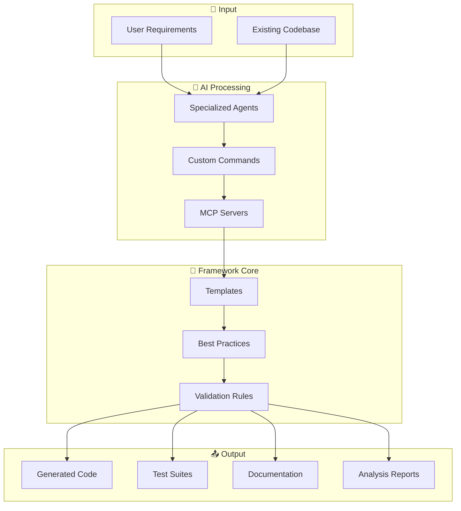
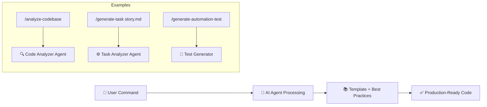
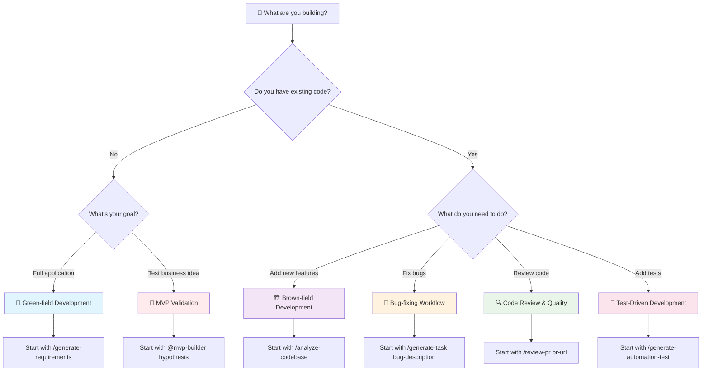

# Architecture


# System Workflow



# Flowchart


<details>
<summary><strong>🌱 Green-field Development</strong> - Building from scratch</summary>

```bash
# 1. Create user stories from business needs
/generate-requirements brd.md
# → Context/requirements.md

# 2. Generate system design (optional)  
/generate-design Context/requirements.md
# → Context/design.md

# 3. Break down into tasks
/generate-task Context/requirements.md
# → Context/Tasks/feature-name.md (list of tasks)

# 4. Execute tasks systematically for code generation
/execute-task Context/Tasks/feature-name.md
# → Logic Implementation with TodoWrite tracking

# 5. Quality review (optional)
/analyze-task Context/Tasks/feature-name.md
# → Quality assessment and recommendations for the implemented logic
```