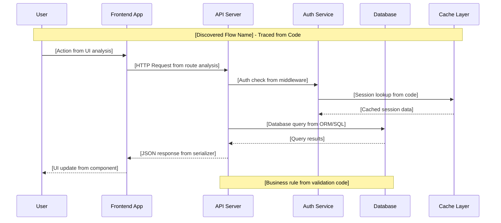

name: "Codebase Analysis Report Template - Comprehensive Reverse Engineering"
description: |

## Purpose
Template for comprehensive codebase analysis and reverse engineering documentation, optimized for stakeholder communication and technical understanding.

## Core Principles
1. **Comprehensive Discovery**: Document all aspects of the system architecture and implementation
2. **Stakeholder Alignment**: Provide both executive summaries and technical deep-dives
3. **Actionable Insights**: Include prioritized recommendations with effort estimates
4. **Quality Assessment**: Validate findings with metrics and confidence levels
5. **Global Rules**: Follow all guidelines in CLAUDE.md and References/Gotchas

---

## 1. Executive Summary

### System Overview
[System purpose and business context in <100 words]

### Technology Stack Summary
[High-level overview of primary technologies used]

### Top 3 Critical Risks
1. **[Risk Name]**: [Impact description and business consequences]
2. **[Risk Name]**: [Impact description and business consequences]
3. **[Risk Name]**: [Impact description and business consequences]

### Top 3 Strategic Recommendations
1. **[Recommendation]**: [Expected benefit and ROI] - *Why now: [Urgency reason]*
2. **[Recommendation]**: [Expected benefit and ROI] - *Why now: [Urgency reason]*
3. **[Recommendation]**: [Expected benefit and ROI] - *Why now: [Urgency reason]*

### Analysis Confidence Level
**Overall Confidence**: [High/Medium/Low]
**Key Assumptions**: [List critical assumptions made during analysis]

---

## 2. Technical Architecture Documentation

### System Architecture Overview
[High-level description of system architecture and design philosophy]

### C4 Architecture Diagrams

#### Context Diagram
```mermaid
[C4 Context diagram showing system boundaries and external actors]
```

#### Container Diagram
```mermaid
[C4 Container diagram showing major system components]
```

#### Component Diagram
```mermaid
[C4 Component diagram for critical subsystems]
```

#### Deployment Diagram
```mermaid
[Deployment topology showing infrastructure and environments]
```

### Design Patterns Identified
| Pattern Type | Pattern Name | Usage | Location |
|--------------|--------------|--------|----------|
| Architectural | [Pattern] | [How it's used] | [Where in codebase] |
| Design | [Pattern] | [How it's used] | [Where in codebase] |
| Integration | [Pattern] | [How it's used] | [Where in codebase] |

### Anti-Patterns Detected
| Anti-Pattern | Impact | Location | Remediation |
|--------------|---------|----------|-------------|
| [Anti-pattern name] | [Impact description] | [File/module] | [Fix approach] |

### System Topology
- **Entry Points**: [List of system entry points]
- **Communication Protocols**: [REST, GraphQL, gRPC, WebSocket, etc.]
- **Data Flow**: [Description of data flow patterns]
- **External Integrations**: [Third-party services and APIs]

---

## 3. Technology Stack Inventory

### Languages & Frameworks
| Category | Technology | Version | Purpose | Health Status | Notes |
|----------|------------|---------|---------|---------------|-------|
| Language | [Tech] | [Version] | [Usage] | [Active/Deprecated/EOL] | [Notes] |
| Framework | [Tech] | [Version] | [Usage] | [Active/Deprecated/EOL] | [Notes] |
| Runtime | [Tech] | [Version] | [Usage] | [Active/Deprecated/EOL] | [Notes] |

### Infrastructure & Platform
| Category | Technology | Version | Purpose | Configuration | Notes |
|----------|------------|---------|---------|---------------|-------|
| Database | [Tech] | [Version] | [Usage] | [Config highlights] | [Notes] |
| Cache | [Tech] | [Version] | [Usage] | [Config highlights] | [Notes] |
| Queue | [Tech] | [Version] | [Usage] | [Config highlights] | [Notes] |
| Cloud | [Provider] | [Services] | [Usage] | [Config highlights] | [Notes] |

### Development & Operations
| Category | Tool | Version | Purpose | Notes |
|----------|------|---------|---------|-------|
| Build | [Tool] | [Version] | [Usage] | [Notes] |
| CI/CD | [Tool] | [Version] | [Usage] | [Notes] |
| Monitoring | [Tool] | [Version] | [Usage] | [Notes] |
| Testing | [Tool] | [Version] | [Usage] | [Notes] |

---

## 4. Application Inventory

### Applications & Services

#### [Application/Service Name]
- **Type**: [Web App/API/Worker/Function/CLI]
- **Entry Point**: [Main file or bootstrap location]
- **Build Command**: `[command]`
- **Run Command**: `[command]`
- **Default Port**: [port number]
- **Environment Variables**:
  - `[VAR_NAME]`: [Purpose and requirements]
- **Dependencies**: [Key dependencies]
- **Health Check**: [Endpoint or mechanism]
- **Purpose**: [Brief description of functionality]

[Repeat for each application/service]

---

## 5. Critical Business Logic Documentation

### Core Business Logic Classes
| Class/Module | Location | Business Purpose | Key Methods | Business Rules | Dependencies |
|--------------|----------|------------------|-------------|----------------|--------------|
| [ClassName] | [File path] | [Plain English description of what business problem this solves] | [Primary methods and their purpose] | [Key business rules enforced] | [Critical dependencies] |
| [UserAuthentication] | auth/services/auth.ts | Manages user login, session validation, and access control | authenticate(), validateToken(), checkPermissions() | Password must be 8+ chars, sessions expire after 24h, max 3 login attempts | JWT library, User model |
| [PaymentProcessor] | billing/services/payment.ts | Handles payment transactions, refunds, and subscription management | processPayment(), refund(), updateSubscription() | Min transaction $1, refunds within 30 days, retry failed payments 3x | Stripe API, Transaction model |
| [InventoryManager] | inventory/services/stock.ts | Tracks product availability and manages stock levels | checkStock(), reserveItems(), updateQuantity() | Prevent overselling, auto-reorder at 20% threshold, FIFO allocation | Database, Product model |

### Business Process Flows
| Process Name | Entry Class | Flow Description | Critical Decision Points | Error Handling |
|--------------|-------------|------------------|--------------------------|----------------|
| [Process] | [Starting class] | [Step-by-step business flow in plain English] | [Where business logic branches] | [How failures are handled] |
| Order Fulfillment | OrderService | 1. Validate customer 2. Check inventory 3. Process payment 4. Create shipment 5. Send confirmation | Payment approval, Stock availability, Shipping restrictions | Rollback on failure, notify customer |

### Business Rule Validation
| Rule Category | Implementation Location | Description | Validation Logic | Failure Impact |
|---------------|------------------------|-------------|------------------|----------------|
| [Category] | [Class/Method] | [Plain English rule] | [How it's checked] | [What happens if violated] |
| Pricing Rules | PricingEngine.calculate() | Apply discounts based on customer tier and volume | Check tier status, calculate volume discount, apply max 50% total | Order rejected, manual review required |
| Compliance | ComplianceChecker.validate() | Ensure transactions meet regulatory requirements | Verify customer KYC, check transaction limits, validate geographic restrictions | Transaction blocked, compliance alert triggered |

---

## 6. Source Code Organization

### Repository Structure

#### Frontend Applications
```
[Tree structure of frontend code]
```
**Notable Patterns**: [Observations about organization]

#### Backend Services
```
[Tree structure of backend code]
```
**Notable Patterns**: [Observations about organization]

#### Shared Libraries
```
[Tree structure of shared code]
```
**Notable Patterns**: [Observations about organization]

#### Infrastructure as Code
```
[Tree structure of IaC]
```
**Notable Patterns**: [Observations about organization]

---

## 7. Routes & Entry Points

### UI Routes
| Route Path | Component | Purpose | Authentication |
|------------|-----------|---------|----------------|
| [Path] | [Component] | [Purpose] | [Required/Optional/None] |

### API Endpoints
| Method | Path | Purpose | Authentication | Rate Limit |
|--------|------|---------|----------------|------------|
| [GET/POST/etc] | [Path] | [Purpose] | [Auth type] | [Limit] |

### Background Jobs
| Job Name | Trigger | Schedule | Purpose | Dependencies |
|----------|---------|----------|---------|--------------|
| [Name] | [Type] | [CRON/Timer] | [Purpose] | [Services] |

### Message Queues/Events
| Topic/Queue | Producer | Consumer | Message Type | Purpose |
|-------------|----------|----------|--------------|---------|
| [Name] | [Service] | [Service] | [Type] | [Purpose] |

---

## 8. Code Quality Report

### Quality Metrics Dashboard
| Metric | Value | Target | Status | Notes |
|--------|-------|--------|--------|-------|
| Code Coverage | [%] | ≥80% | [🟢/🟡/🔴] | [Notes] |
| Cyclomatic Complexity | [Avg] | <10 | [🟢/🟡/🔴] | [Hotspots] |
| Code Duplication | [%] | <5% | [🟢/🟡/🔴] | [Locations] |
| Technical Debt | [Hours] | - | [🟢/🟡/🔴] | [Priority items] |
| Documentation Coverage | [%] | ≥70% | [🟢/🟡/🔴] | [Gaps] |

### Top 3 Code Smells Inventory
| Smell Type | Severity | Location | Impact | Remediation |
|------------|----------|----------|---------|-------------|
| [Type] | [High/Medium/Low] | [File/Module] | [Impact] | [Fix approach] |

### Test Coverage Analysis
| Component | Coverage | Critical Gaps | Recommended Actions |
|-----------|----------|---------------|---------------------|
| [Component] | [%] | [Uncovered areas] | [Testing priorities] |

---

## 9. Security Assessment

### Top 3 Vulnerability Summary
| Severity | Count | Examples | Immediate Action Required |
|----------|-------|----------|---------------------------|
| Critical | [#] | [CVE/CWE refs] | [Yes/No - Actions] |
| High | [#] | [CVE/CWE refs] | [Yes/No - Actions] |
| Medium | [#] | [CVE/CWE refs] | [Yes/No - Actions] |
| Low | [#] | [CVE/CWE refs] | [Yes/No - Actions] |

### OWASP Top 10 Compliance
| Risk Category | Status | Findings | Recommendations |
|---------------|--------|----------|-----------------|
| [A01:2021 - Broken Access Control] | [🟢/🟡/🔴] | [Findings] | [Actions] |
| [A02:2021 - Cryptographic Failures] | [🟢/🟡/🔴] | [Findings] | [Actions] |
[Continue for all OWASP Top 10]

### Top 3 Security Recommendations
1. **[Critical Fix]**: [Description and implementation approach]
2. **[High Priority]**: [Description and implementation approach]
3. **[Medium Priority]**: [Description and implementation approach]

---

## 10. Performance Analysis

### Top 3 Performance Metrics
| Area | Current State | Issues | Optimization Opportunities |
|------|---------------|---------|---------------------------|
| Database | [Metrics] | [N+1 queries, missing indexes] | [Specific improvements] |
| API Response | [Metrics] | [Slow endpoints] | [Caching, pagination] |
| Frontend Bundle | [Size] | [Large dependencies] | [Code splitting, lazy loading] |
| Memory Usage | [Metrics] | [Leaks, high consumption] | [Optimization strategies] |

### Top 3 Performance Bottlenecks
1. **[Bottleneck]**: [Impact and metrics] - *Solution: [Approach]*
2. **[Bottleneck]**: [Impact and metrics] - *Solution: [Approach]*
3. **[Bottleneck]**: [Impact and metrics] - *Solution: [Approach]*

---

## 11. Development & Operations Guide

### Local Development Setup
1. **Prerequisites**:
   - [Software/tool] version [X.X]
   - [Software/tool] version [X.X]

2. **Environment Setup**:
   ```bash
   [Setup commands]
   ```

3. **Configuration**:
   - Copy `.env.example` to `.env`
   - Set required variables: [List]

4. **Build & Run**:
   ```bash
   [Build commands]
   [Run commands]
   ```

5. **Verification**:
   - Access: [URLs and ports]
   - Health check: [Endpoints]

### Deployment Process
1. **Build Pipeline**: [Description and commands]
2. **Deployment Stages**: [Dev → Staging → Production]
3. **Configuration Management**: [Approach and tools]
4. **Rollback Procedure**: [Steps and commands]

### Monitoring & Observability
- **Logs**: [Location and access method]
- **Metrics**: [Dashboard URLs and key metrics]
- **Alerts**: [Critical alerts and thresholds]
- **Tracing**: [APM tools and configuration]

---

## 12. User Journey Documentation & Use Case Analysis

### Discovered Actors & System Interactions
*Based on reverse engineering of routes, API endpoints, and authentication patterns*

| Actor Type | Actor Name | Evidence Location | Key Interactions | Access Level |
|------------|------------|-------------------|------------------|--------------|
| [Primary] | [Actor Name] | [auth/middleware, routes] | [List of actions] | [Permissions found] |
| [Secondary] | [Actor Name] | [API endpoints, UI routes] | [List of actions] | [Permissions found] |
| [System] | [External System] | [integrations, webhooks] | [Data exchange] | [API keys, tokens] |

### Reverse-Engineered Use Case Diagram
*Derived from codebase analysis - shows actual system interactions*

```mermaid
graph TB
    %% Discovered Actors (from authentication/routing analysis)
    User[👤 End User]
    Admin[👤 Admin]
    ApiClient[🖥️ API Client]
    Webhook[🔗 External System]
    
    %% System Boundary (identified from application structure)
    subgraph "Analyzed System"
        UC1[UC-01: Authentication]
        UC2[UC-02: Profile Management]
        UC3[UC-03: Data Access]
        UC4[UC-04: Administrative Tasks]
        UC5[UC-05: API Integration]
        UC6[UC-06: Webhook Processing]
    end
    
    %% Relationships (based on route and middleware analysis)
    User --> UC1
    User --> UC2
    User --> UC3
    Admin --> UC1
    Admin --> UC4
    ApiClient --> UC5
    Webhook --> UC6
    
    %% Dependencies (from code analysis)
    UC2 -.->|requires| UC1
    UC3 -.->|requires| UC1
    UC4 -.->|requires| UC1
    UC5 -.->|optional| UC1
```



### Critical User Flow Analysis
*Evidence: Route definitions, API endpoints, and business logic*

#### [Discovered Flow - e.g., User Authentication]
- **Evidence Sources**: 
  - Routes: [File path and line numbers]
  - Middleware: [Authentication handlers]
  - Business Logic: [Core classes involved]
- **Actual Flow Steps**:
  1. [Step with code evidence]
  2. [Step with code evidence]
  3. [Step with code evidence]
- **Error Handling**: [Exception handlers and error codes found]
- **Security Measures**: [Validation and authorization checks]
- **Performance Considerations**: [Caching, rate limiting found]

### Actor-Feature Interaction Analysis
*Visual mapping of discovered user interactions with system features*

```mermaid
graph LR
    %% Discovered Actor nodes
    A1[👤 End User]
    A2[👤 Admin]
    A3[👤 API Consumer]
    A4[🖥️ Background Jobs]
    A5[🔗 Webhooks]
    
    %% Discovered Feature nodes (from route analysis)
    F1[🔐 Authentication]
    F2[📊 Dashboard]
    F3[📈 Reports]
    F4[⚙️ Settings]
    F5[🔌 API Access]
    F6[📝 Data Entry]
    F7[🔄 Background Processing]
    
    %% Evidence-based connections
    A1 -.->|GET /auth/login| F1
    A1 -.->|GET /dashboard| F2
    A1 -.->|GET /reports| F3
    A1 -.->|POST /data| F6
    
    A2 -.->|Full Access| F1
    A2 -.->|Full Access| F2
    A2 -.->|Full Access| F3
    A2 -.->|PUT /admin/settings| F4
    
    A3 -.->|Bearer Token| F5
    A4 -.->|Scheduled| F7
    A5 -.->|POST /webhooks/*| F7
```



### Use Case Gap Analysis
*Comparing discovered interactions with typical system expectations*

| Expected Use Case | Found in Code | Evidence | Gap Assessment | Recommendation |
|-------------------|---------------|-----------|----------------|----------------|
| [User Registration] | [Yes/No/Partial] | [File paths] | [Missing features] | [Implementation needed] |
| [Password Reset] | [Yes/No/Partial] | [File paths] | [Security gaps] | [Security improvements] |
| [Data Export] | [Yes/No/Partial] | [File paths] | [Format limitations] | [Feature enhancement] |
| [Audit Logging] | [Yes/No/Partial] | [File paths] | [Incomplete tracking] | [Compliance requirement] |

### Sequence Diagram - Critical Business Flow
*Based on actual code execution paths*



### User Roles & Permissions Analysis
*Extracted from authorization code, middleware, and database schemas*

| Role | Evidence Location | Discovered Permissions | Implementation Quality | Security Assessment |
|------|------------------|------------------------|----------------------|-------------------|
| [Role] | [auth/roles.js:45] | [List from code] | [Good/Fair/Poor] | [Secure/Needs Review] |
| [Admin] | [middleware/admin.js:12] | [CRUD operations] | [Good] | [Review needed: hardcoded checks] |
| [User] | [auth/permissions.ts:78] | [Read-only access] | [Fair] | [Secure] |

### Core User Flows

#### [Flow Name - e.g., User Registration]
1. **Entry Point**: [Route handler and file location]
2. **Code Path**:
   1. [Controller method with file:line]
   2. [Service method with file:line]
   3. [Database operation with file:line]
3. **Success Criteria**: [Response format from code]
4. **Error Scenarios**: [Exception handlers found]
5. **Related APIs**: [Endpoint definitions from routes]
6. **Code Quality**: [Observations about implementation]

[Repeat for each discovered flow]

### API Usage Examples

#### [Operation Name]
**Endpoint**: `[Method] [Path]`
**Headers**:
```json
{
  "Authorization": "Bearer [token]",
  "Content-Type": "application/json"
}
```
**Request Body**:
```json
[Example request]
```
**Response**:
```json
[Example response]
```
**Error Codes**: [List with meanings]

---

## 13. Risk Register

### Risk Register
| Risk | Category | Severity | Likelihood | Impact | Mitigation |
|------|----------|----------|------------|---------|------------|
| [Risk] | [Security/Performance/Technical Debt/Operational] | [High/Medium/Low] | [High/Medium/Low] | [Description] | [Approach] |

---

## 14. Dependency Analysis

### Critical Dependencies
| Dependency | Version | Status | Risk | Recommended Action |
|------------|---------|--------|------|-------------------|
| [Library/Service] | [Version] | [Active/Deprecated/EOL] | [Security/Performance/Maintenance] | [Update/Replace/Monitor] |

### Dependency Health Summary
- **Total Dependencies**: [Count]
- **Outdated**: [Count] ([%])
- **Vulnerable**: [Count] ([%])
- **Deprecated**: [Count] ([%])

---


*This codebase analysis report provides a comprehensive understanding of the system architecture, quality, and improvement opportunities to support informed decision-making.*