name: "Base Feature Template - Context-Rich with Validation Loops"
description: |

## Purpose
Template optimized for AI agents to implement features with sufficient context and self-validation capabilities to achieve working code through iterative refinement.

## Core Principles
1. **Context is King**: Include ALL necessary documentation, examples, and caveats
2. **Validation Loops**: Provide executable tests/lints the AI can run and fix
3. **Information Dense**: Use keywords and patterns from the codebase
4. **Progressive Success**: Start simple, validate, then enhance
5. **Global rules**: Be sure to follow all rules in CLAUDE.md

---

## Goal
[What needs to be built - be specific about the end state and desires agains the current state]

## Why
- [Business value and user impact]
- [Integration with existing features]
- [Problems this solves and for whom]

## What
[User-visible behavior and technical requirements]

### Success Criteria
- [ ] [Specific measurable outcomes]

## Tech Stack
- [Layer]: [Technology list]

Note: Include the research based technology stack

## Functional Requirements
- [List of functional scopes]

## Non-Functional Requirements
- [List of non-fucntional socpe]

## Technical Requirements
- [Based on the technology stack and other implementation aspects]

## Data Requirements
- [Detailed Database schema for each of the entity]

## UX Requirements
- [Detailed UX requirements based on the research following modern design approach and standards, unless something specified by the user]

## Use Case Analysis

### Actors & System Boundary
- [Primary Actor]: [Role description and responsibilities]
- [Secondary Actor]: [Supporting role and interaction type]
- [System Actor]: [External systems that interact with our system]

### Use Case Diagrams (Mermaid)

#### System Overview Use Case Diagram

```mermaid
graph TB
    %% Actors
    User[👤 User]
    Admin[👤 Admin]
    ExternalSystem[🖥️ External System]
    
    %% System Boundary
    subgraph "System Name"
        UC1[UC-01: Login]
        UC2[UC-02: Manage Profile]
        UC3[UC-03: View Dashboard]
        UC4[UC-04: Generate Reports]
        UC5[UC-05: Admin Panel]
        UC6[UC-06: API Integration]
    end
    
    %% Relationships
    User --> UC1
    User --> UC2
    User --> UC3
    Admin --> UC1
    Admin --> UC4
    Admin --> UC5
    ExternalSystem --> UC6
    
    %% Includes/Extends (if needed)
    UC2 -.->|includes| UC1
    UC3 -.->|includes| UC1
```


#### Detailed Use Case Flow Diagrams
For complex use cases, create sequence diagrams showing interaction flows:


#### Actor-Feature Interaction Matrix

```mermaid
graph LR
    %% Actor nodes
    A1[👤 End User]
    A2[👤 Admin]
    A3[👤 Manager]
    A4[🖥️ External API]
    
    %% Feature nodes
    F1[🔐 Authentication]
    F2[📊 Dashboard]
    F3[📈 Reports]
    F4[⚙️ Settings]
    F5[🔌 Integration]
    
    %% Connections with access levels
    A1 -.->|Primary| F1
    A1 -.->|Primary| F2
    A1 -.->|View Only| F3
    
    A2 -.->|Primary| F1
    A2 -.->|Primary| F2
    A2 -.->|Full Access| F3
    A2 -.->|Primary| F4
    
    A3 -.->|Primary| F1
    A3 -.->|Primary| F2
    A3 -.->|Primary| F3
    
    A4 -.->|Automated| F5
```


#### System Context Diagram


#### State Transition Diagram (for stateful use cases)


### Use Case Specifications
For each use case, provide detailed specifications:

#### UC-[ID]: [Use Case Name]
- **Actor**: [Primary Actor]
- **Goal**: [What the actor wants to achieve]
- **Preconditions**: [System state before use case]
- **Success Scenario**: 
  1. [Step 1]
  2. [Step 2]
  3. [Step 3]
- **Extensions/Alternatives**:
  - 2a. [Alternative flow]
  - 3a. [Exception handling]
- **Postconditions**: [System state after successful completion]
- **Related User Stories**: [US-01, US-02, US-03]

### Mermaid Use Case Creation Guidelines for AI Agents

When creating use case diagrams using this template:

1. **Start Simple**: Begin with the system overview diagram showing all actors and main use cases
2. **Add Detail Progressively**: Create sequence diagrams only for complex interactions
3. **Use Consistent Icons**: 
   - 👤 for human actors
   - 🖥️ for system actors  
   - 🔐🔌📊📈⚙️ for different feature types
4. **Validate Against User Stories**: Ensure every use case maps to at least one user story
5. **Consider Access Levels**: Use different line styles (solid, dashed, dotted) for different access types

### Mermaid Syntax Quick Reference
- `graph TB` = Top to Bottom layout
- `graph LR` = Left to Right layout  
- `-->` = Direct relationship
- `-.->` = Include/Extend relationship
- `subgraph` = System boundaries
- `sequenceDiagram` = Interaction flows
- `stateDiagram-v2` = State transitions
- `C4Context` = System context diagrams

## Core Entities
### [Entity_#_Name]

- [Key responsibilities]
- [Business rules]
- [Constraints or invariants]

## Stories
- [For each of the epic, containing epicID and short description define the stories]

### User Stories
- User Stories, complete with:  
  * User Story ID  
  * Full story format: "As a..., I want..., so that..."  
  * Acceptance Criteria

Note: 
- If a user story requires more than 20 hours of effort, break it down into smaller, more manageable stories.
- Document every functional and  non-functional requirement as a detailed user story and map it to an Epic.
- Ensure that data requirements and core entities are considered during the user story creation process.
- If the codebase URL is not provided, create user stories for creation of new project based on the technical stack and organize them under the Technical Epic.
- Clearly define acceptance criteria for each user story, ensuring they are specific, measurable, and testable.
Regularly review and refine user stories to maintain relevance and accuracy throughout the project lifecycle.

Format:
```yaml
### Epic: \<Title\> for each epic.  
* Under each epic, add all the stories associated to the epic:  
  * #### User Story: <ID>  
  * [Story to be populated]
      Acceptance Criteria:[]
      
```
## Risks & Mitigations
- [Limit this to the scope of Functional and Non-Functional Requirements only]

## Constraints & Assumptions
- [Rationale, limited to Functional and Non-Functional Requirements scope only]

## All Needed Context

### Documentation & References (list all context needed for planning)
```yaml
# MUST READ - Include these in your context window
- url: [Official API docs URL]
  why: [Specific sections/methods you'll need]
  
- file: [path/to/example.py]
  why: [Pattern to follow, gotchas to avoid]
  
- doc: [Library documentation URL] 
  section: [Specific section about common pitfalls]
  critical: [Key insight that prevents common errors]

- docfile: [PRPs/ai_docs/file.md]
  why: [docs that the user has pasted in to the project]

```
## Areas for Potential Improvement  
- [List specific, actionable suggestions for improvement, if any.]